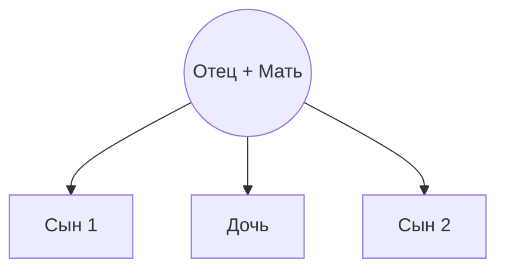

Welcome to My GitHub Space! 👋

I'm: 전성식 (Ten Sen Shchik)

Age: 31

Education: Graduated from Gubkin Russian State University of Oil and Gas

About Me:

🌏 Currently based in South Korea, Seongnam

💡 Passionate Overseas Developer with a focus on Java

🎓 Alumni of Gubkin Russian State University of Oil and Gas

Tech Stack:

Back End:

Front End:

Database:

Other:

Happy coding! 🖥️✨

